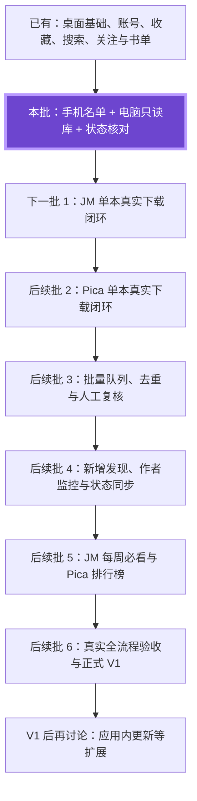

# 双库批次后的路线图

依据截至 2026-09-10 的用户决定、当前实现与交接记录规划。当前双库代码正在完成 CI 收尾；最终通过证据见本批开发报告与 PR #19。代码实现、安装包交付、用户验收分别记录。

## 当前位置

**当前位置：在线管理基础已可用 → 本批接入手机/电脑双库 → 下一批开始真实下载闭环。**

已交付使用的部分包括桌面基础、两源登录与会话、收藏浏览、搜索和详情、关注及书单。此前 Pica 连续目录修复和本批双库功能已进入开发分支，等待合适的后续安装包验收。真实下载队列、下载完成后的电脑状态以及监控发现到桌面处理之间尚未完整接通。

“后续批 1–6”是从本批结束往后计数的计划序号，不是版本号。较小批次可以合并，复杂来源适配可以拆分；不保证每批都生成安装包。下一个适合正式打包的节点是两源单本下载均贯通之后，届时合入待交付 Pica 修复与本批双库功能，具体版本号在打包时确定。

## 后续批次与工作量

| 顺序 | 范围 | 批次完成与验收标准 | 规模估计 |
|---|---|---|---|
| 本批 · 当前位置 | 手机 TXT/手动入库记录、电脑库、在线状态、两下载器目录兼容 | 手机优先；仅电脑有显示已下载；PC 副本保留；明确编号准确核对；本批 CI 完成后等待安装包真实验收 | 代码实现已完成，当前验证收尾 |
| 下一批 1 | JM 单本真实任务与下载 | 从详情或单个编号/链接创建任务；复用既有执行模块与上游图片处理逻辑；完成作品目录和元数据；完成后电脑显示已下载；手机标记独立；纳入初始持久队列和四项基础可靠性 | 2–4 工程人日，较大 |
| 后续批 2 | Pica 单本真实任务与下载 | 适配 Pica 章节/图片及账号作用域；输出兼容现有下载器目录；通过两源各自真实样本；与同一套队列/状态共享，避免复制一套调度 | 2–3 工程人日，中大 |
| 后续批 3 | 批量下载、跨来源关系与复核 | 多选一次确认；补齐范围清楚；已下载/已入库跳过；同作同版本的明确关联、换源、另存与歧义复核；单作失败不阻塞其他任务；资源档位真正限制并发 | 3–5 工程人日，大 |
| 后续批 4 | 收藏/作者新作发现与状态同步 | 在已确认运行范围内检查新增；发现列表到库存对照、复核、批量确认贯通；接入已有监控核心与必要完成状态同步；成功落盘不因同步重试而重复下载 | 3–5 工程人日，大 |
| 后续批 5 | 发现入口 | 接入 JM 每周必看、Pica 排行榜，支持详情、关注、加入书单或下载；复用现有来源详情和任务链 | 1–2 工程人日，中 |
| 后续批 6 | 正式 V1 集成验收 | 两源真实登录→选书→下载→电脑已下载→手动转手机→已入库；覆盖批量、重启、错误重试和已有文件保留；安装升级保留数据；修复收尾 | 2–4 工程人日，中大 |

合计约 **13–23 工程人日**，是有效工程工作规模的估计，不是实际日历交付承诺；CI 排队与用户真实验收等待另计。把握程度中等偏低，完成第一条真实下载链后重新估算。已将现成代码复用、取消导出和简化恢复计入；各批测试已包含在本批工作量，最后一批只计跨模块验收与收尾，避免重复计量。

## 固定边界

- 手机有即已入库；手机没有且电脑有即已下载。传入手机由用户操作，通过手动标记或新 TXT 更新；电脑副本保留。
- 下载结果跟随现有 lanyeeee JM/Pica 下载器目录约定。历史 ZIP-only 规划由较新的用户要求覆盖；已有 ZIP/CBZ 识别保留。
- 四项基础可靠性从真实任务首次接入时一并实现：错误可见、可手动重试；未完成不标完成；保留已完成文件避免重复下载或覆盖；正常退出保存队列。复杂离线模式、长期自动重连不单列开发批次。
- PDF/CBZ 导出取消。应用内更新留到正式 V1 后讨论；阅读器、自动传手机、旧作品自动补章重打包不属于当前首版范围。
- 同一套正式任务在一个执行位置运行。本机保留轻量、明确有收益的操作；云端承担正式回归与构建，不重复运行本地/云端相同套件。
- 本路线图不表示立即运行真实下载、扫描未指定目录或开启生产。真实任务批次按现有执行约定，在可审查的具体样例与输出方案具备后验证。

## 依据

- [当前开发交接](DEVELOPMENT_HANDOFF.md)
- [本批双库报告](LOCAL_WORKBENCH_DUAL_LIBRARY_2026-09-10.md)
- [上游目录兼容记录](UPSTREAM_DIRECTORY_COMPATIBILITY_2026-09-10.md)
- [既有功能范围](LOCAL_WORKBENCH_FEATURE_SCOPE.md)：历史输出格式表述以当前交接和用户最新要求为准。
